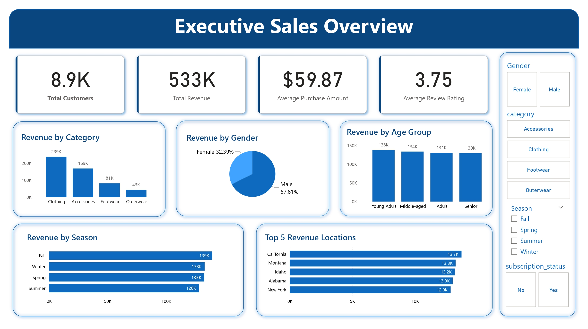
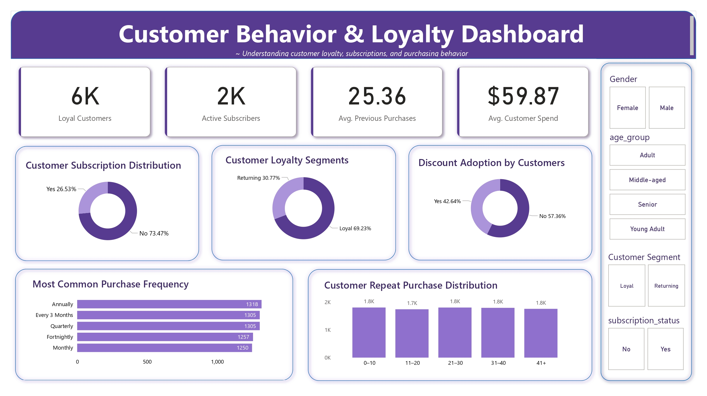
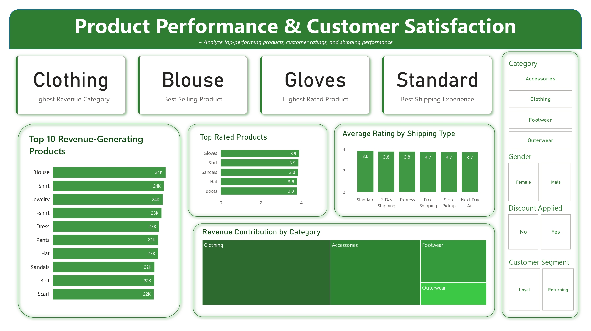

# 🛍️ Customer Shopping Behavior Analysis

An end-to-end **Data Analytics** project that analyzes customer shopping behavior using **Python, MySQL, SQL, and Power BI**. The project demonstrates the complete analytics workflow, from data preprocessing to interactive dashboard creation and business insights.

---

## 📌 Problem Statement

Retail businesses collect large amounts of customer transaction data, but raw data alone cannot support business decisions.

The goal of this project is to analyze customer shopping behavior to answer important business questions, such as:

- Which product categories generate the highest revenue?
- Which customer groups contribute the most sales?
- Which products perform the best?
- How do subscriptions and discounts affect customer purchases?
- Which seasons and locations generate the highest revenue?
- How satisfied are customers with products and shipping services?

The final outcome is an interactive Power BI dashboard that helps businesses make data-driven decisions.

---

## 🛠️ Tools & Technologies

- **Python**
- **Pandas**
- **NumPy**
- **MySQL**
- **SQL**
- **SQLAlchemy**
- **PyMySQL**
- **Power BI**
- **Git & GitHub**

---

## 📂 Project Workflow

### 1. Data Collection
- Imported the customer shopping dataset.

### 2. Data Cleaning (Python)
- Removed duplicate records.
- Handled missing values.
- Created new features such as Age Group and Customer Segment.
- Generated additional realistic synthetic records for learning purposes.
- Loaded the cleaned dataset into MySQL.

### 3. SQL Analysis
Performed business analysis to calculate:
- Total Revenue
- Total Customers
- Average Purchase Amount
- Revenue by Category
- Revenue by Gender
- Revenue by Season
- Revenue by Location
- Customer Loyalty
- Subscription Analysis
- Discount Analysis
- Product Performance
- Customer Satisfaction

### 4. Power BI Dashboard
Created interactive dashboards with KPIs, charts, and filters to visualize business performance and customer behavior.

---

# 📊 Dashboards

## Dashboard 1 – Executive Sales Overview

This dashboard provides an overview of overall business performance.

**KPIs**
- Total Customers
- Total Revenue
- Average Purchase Amount
- Average Review Rating

**Visuals**
- Revenue by Category
- Revenue by Gender
- Revenue by Age Group
- Revenue by Season
- Top Revenue Locations

---

## Dashboard 2 – Customer Behavior & Loyalty

This dashboard focuses on customer purchasing behavior and loyalty.

**KPIs**
- Loyal Customers
- Active Subscribers
- Average Previous Purchases
- Average Customer Spend

**Visuals**
- Customer Segments
- Subscription Distribution
- Discount Analysis
- Purchase Frequency
- Repeat Purchases

---

## Dashboard 3 – Product Performance & Customer Satisfaction

This dashboard analyzes product sales and customer satisfaction.

**KPIs**
- Highest Revenue Category
- Best Selling Product
- Highest Rated Product
- Best Shipping Type

**Visuals**
- Top Revenue Products
- Product Ratings
- Shipping Performance
- Category Revenue

---

# 📈 Key Insights

- Generated approximately **$533K** in total revenue from **8.9K customer transactions**.
- Clothing is the highest revenue-generating product category.
- Blouse is the best-selling product.
- Young Adult customers contribute the highest revenue.
- Male customers account for the majority of total sales.
- Average customer purchase amount is **$59.87**.
- Most customers are loyal and make repeat purchases.
- Subscription adoption has room for improvement.
- Standard Shipping receives the highest customer satisfaction.
- Fall is the highest-performing season.

---

# 💡 Business Recommendations

- Increase inventory for high-performing product categories.
- Launch targeted campaigns for Young Adult customers.
- Improve subscription offers to increase customer enrollment.
- Strengthen customer loyalty programs.
- Promote best-selling products through marketing campaigns.
- Improve lower-performing product categories using customer feedback.
- Maintain high-quality shipping services.
- Focus marketing efforts on high-performing regions.

---

# 📌 Dataset Note

The original dataset contained approximately **3,900 records**. To simulate a larger retail environment, additional **synthetic records** were generated using Python while preserving the original data distribution. The final dataset contains approximately **8,900 records** and is intended for educational and portfolio purposes.

---

# 🎯 Skills Demonstrated

- Data Cleaning
- Data Preprocessing
- Feature Engineering
- SQL Analysis
- KPI Development
- Business Intelligence
- Data Visualization
- Dashboard Design
- Business Storytelling

---

# 🔮 Future Improvements

- Sales Forecasting
- Customer Segmentation using Machine Learning
- Customer Lifetime Value Analysis
- Automated ETL Pipeline
- Interactive Web Dashboard

---

## 👩‍💻 Author

**Sejal Londhe**

B.Tech in Data Science | Data Analyst | Python | SQL | Power BI

⭐ If you found this project useful, consider giving it a star!
